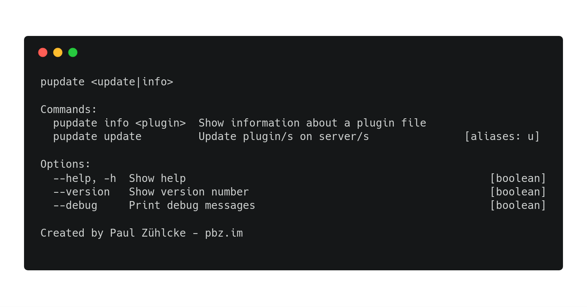
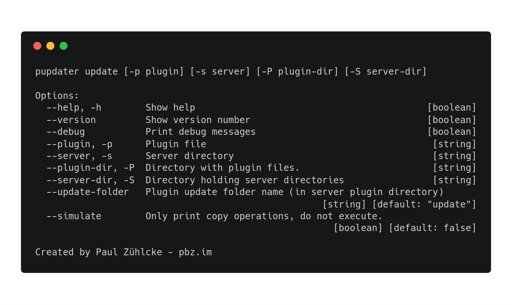

# Plugin Updater
Updater for Spigot / Bukkit servers. Can automatically detect on which servers plugins are installed
and supports bulk operations.
Written in NodeJS, fully async for performance.

`1.0.0` has just been released and it's not perfect yet. Bugfixes and features to come.

## Screenshots

### Update command
